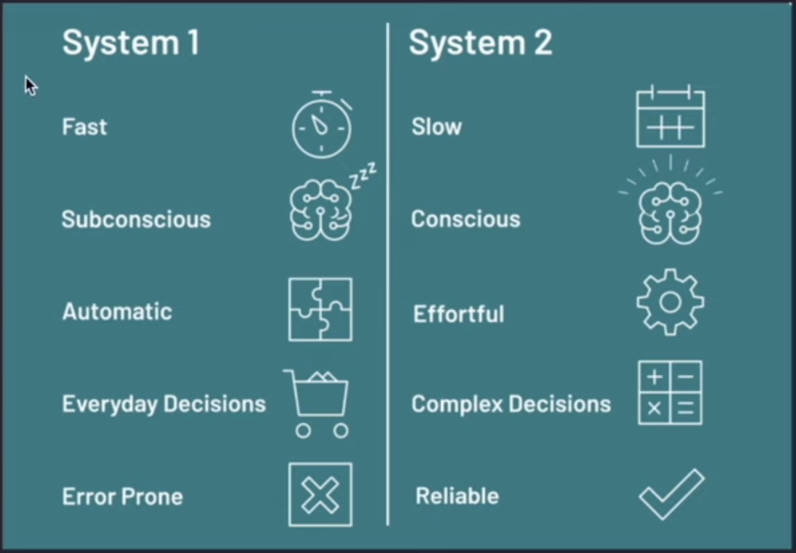
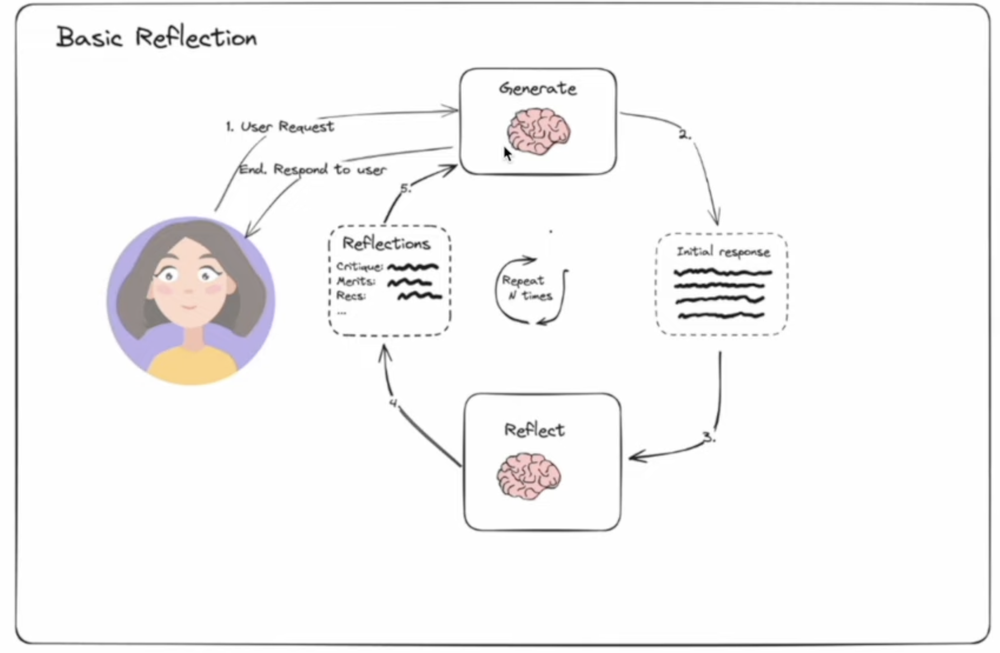

### Re-Act Pattern
- Stands for Reasoning + Acting
- Think: LLM thinks about prompt
- Action: LLM decides answer itself or use a tool
- Action Input: LLM provides the input argument for tool
- `Langchain executes the tool and return output to LLM`
- Observe: LLM observe the result of tool

### Key Features of LangGraph
1. Looping and Branching: Supports conditional logic and looping
2. State Persistence: Supports state persistence, supports pause and resume for long running conversations
3. Human Machine Interaction: Allow human reviews during execution, support state editing
4. Streaming Processing: Support streaming of output
5. Seamless Integration with Langchain: Reuses existing langchain components, supports LCEL expressions

### LangGraph Architecture
1. Node: A node is a unit of work that can be executed. It can be a simple function, a tool, or a complex workflow.
2. Edge: An edge is a connection between two nodes. It can be a conditional edge, a loop edge, or a human edge.
3. Graph: A graph is a collection of nodes and edges. It can be a simple graph, a complex graph, or a multi-agent graph.
4. State: A state is a collection of data that can be used to store the state of the conversation.
5. Action: An action is a unit of work that can be executed. It can be a simple function, a tool, or a complex workflow.

### Reflection Agents in LangGraph
A reflection agent pattern is an AI system pattern that can look at its own outputs and think about them/make it better - just like how we look at ourselves in a mirror and self-reflect, make ourselves better.

### Types of Reflection Agents
1. Basic Reflection Agent: A basic reflection agent is a simple agent that can look at its own outputs and think about them/make it better.
2. Reflexion Agent
3. Language Agent Tree Search (LATS)

